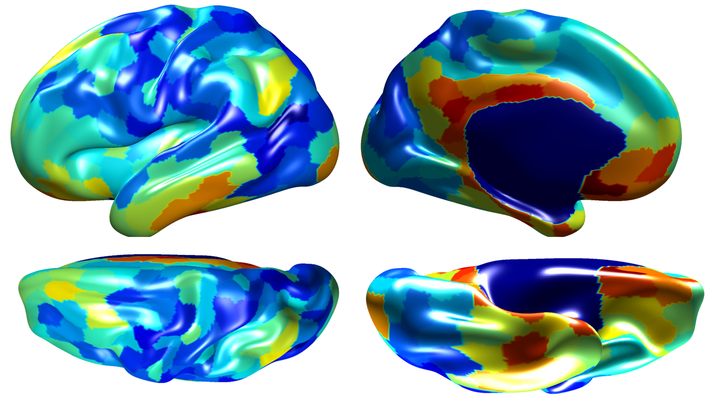
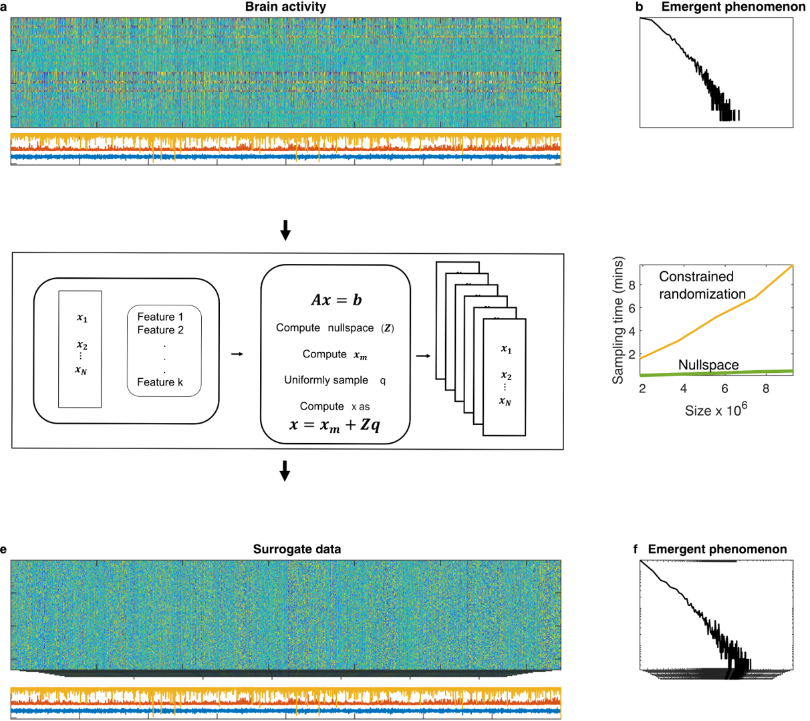

### Building neurobiologically plausible models of brain activity

Models of brain activity play a crucial role in computational/systems neuroscience. Well-grounded and scientifically accurate models let us make accurate predictions/observations about brain activity and allow us to put putative theories/conjectures about brain function to the test. Building a neurobiologicaly plausible model requires us to be able to generate surrogate brain activity with certain features of the data preserved.  

Mathematically, the problem of generating multidimensional surrogate data is NP hard problem without any known solution. In my current work, we have develoved state-of the-art algorithms that let us generate surrogate timeseries that (1) preserve a variety of 'features' or constraints of empirical data (2) are user-friendly and (3) orders of magnitude faster than previous methods

